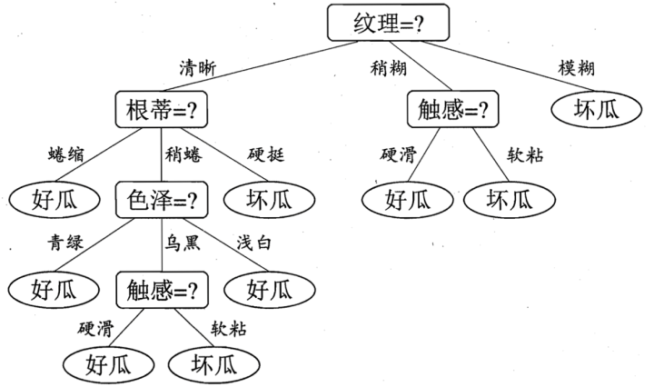

# 决策树

参考资料：

| 资料名称                                                     | 作者            | 页码 | 章节             |
| ------------------------------------------------------------ | --------------- | ---- | ---------------- |
| 《机器学习》                                                 | 周志华          | P73  | 第4章 决策树     |
| 《模式分类》                                                 | Richard O. Duda | P318 | 第8章 非度量方法 |
| 《统计学习方法》                                             | 李航            | P55  | 第5章 决策树     |
| [decision tree](https://en.wikipedia.org/wiki/Decision_tree) | 维基百科        |      |                  |

## 图文描述

我们首先来生活中常见的一个问题（摘自周志华老师的《机器学习》），购买西瓜

当我们购买西瓜时，一般都会有自己的一套判断准则，比如看根蒂、看纹理、看色泽等，从而综合判断这些西瓜是好瓜还是坏瓜。

但是还有另一套方法，比如我们觉得纹理的特征更重要

## 数学理论

## pseudo code

《机器学习》周志华

---

输入：训练集 $\mathcal{D} = \lbrace (x_1, y_1), (x_2, y_2), ……, (x_m, y_m) \rbrace$

​			属性集 $ \mathcal{A} = \lbrace a_1, a_2, ……, a_d \rbrace$

过程：函数$TreeGenerate(\mathcal{D}, \mathcal{A})$

1. 生成节点 node

2. **if**  $\mathcal{D} $  中样本全属于同一类别 $\mathcal{C}$ **then**

   ​	将 node 标记为 $\mathcal{C}$ 类叶结点; **return**

   **end if**

3. **if** $\mathcal{A} = \varnothing$ **OR** $\mathcal{D}$ 中样本在 $\mathcal{A}$ 上取值相同 **then**

   ​	将 node 标记为叶子结点，其类别标记为 $\mathcal{D}$ 中样本数量最多的类; **return**

   **end if**

4.   从 $\mathcal{A}$ 中选择最优化分属性 $a_*$ ;

5. **for** $a_*$ 的每一个值 $a_*^\nu$ **do**

   ​	为 node 生成一个分支; 令 $\mathcal{D}_\nu$ 表示 $\mathcal{D}$ 中在 $a_*$ 上取值为 $a_*^\nu$ 的样本子集; 

   ​	**if** $\mathcal{D}_\nu$ 为空 **then**
   
   ​			将分支结点标记为叶结点，其类别标记为 $\mathcal{D}$ 中样本最多的类; **return**
   
   ​	**else**
   
   ​			以 $TreeGenerate(\mathcal{D}_\nu, A\ \lbrace a_*\rbrace)$ 为分支结点
   
   ​	**end if**
   
   **end for**

输出：以 node 为根节点的一棵决策树

---

## 实现

## 练习