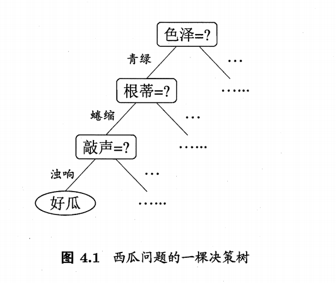

# 导读

决策树(decision tree)是实际上就是日常生活中最常用的方法之一。我们在购物、做选择的需要做决策的行为时，都会潜意识使用到了决策树的思想和方法。

比如周志华老师的《机器学习》书中的案列，“买瓜”，我们的目标肯定是希望选到一个好瓜，那么如何判断瓜贩的哪些瓜是好瓜呢？

我们肯定要从色泽、形态等属性来综合考虑，如下图

但是上面的属性是我们随意排序的，大家可以思考下：

如果先考虑根蒂再考虑色泽是否会影响结果呢？

每次对属性分类的标准我们应该怎么选择呢？也就是色泽多少，敲声音的大小，这个判断值如何得到？

最后，我们还需要考虑，这个二叉树应该在什么环境下终止？因为有可能我们全部分类正确即可停止，也有可能怎么都分类不到完全正确，这时候如何选择？

这些问题我们都会在决策树中详细解释，现在，让我们正式进入决策树，来学习这个日常生活中最常见的模型吧~