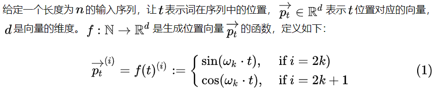
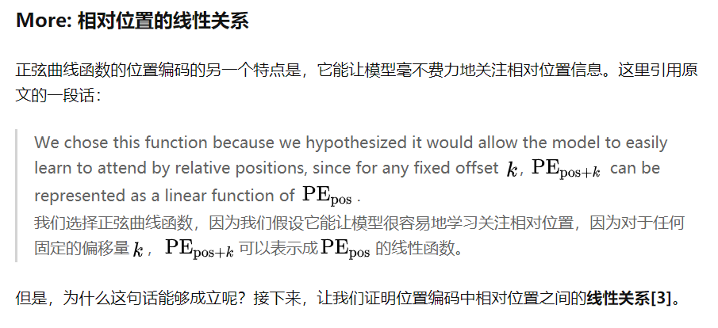

# Transformer

### Transformer 位置编码

参考： https://zhuanlan.zhihu.com/p/106644634

**Positional Encoding**

一种好的编码方案

- 它能为每个时间步输出一个独一无二的编码；
- 不同长度的句子之间，任何两个时间步之间的距离应该保持一致；
- 模型应该能毫不费力地泛化到更长的句子。它的值应该是有界的；
- 它必须是确定性的。

为什么使用sin、cos

