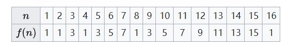

# 约瑟夫环

:heart: [维基百科](https://zh.wikipedia.org/wiki/%E7%BA%A6%E7%91%9F%E5%A4%AB%E6%96%AF%E9%97%AE%E9%A2%98#%E6%95%B0%E5%AD%A6%E6%8E%A8%E5%AF%BC%E8%A7%A3%E6%B3%95)

## 问题描述：

人们站在一个等待被处决的圈子里。 计数从圆圈中的指定点开始，并沿指定方向围绕圆圈进行。 在跳过指定数量的人之后，处刑下一个人。 对剩下的人重复该过程，从下一个人开始，朝同一方向跳过相同数量的人，直到只剩下一个人，并被释放。

问题即，给定人数、起点、方向和要跳过的数字，选择初始圆圈中的位置以避免被处决。

## 数学推导

### $ k = 2 $

先推导 $ k = 2 $ 

如果一开始为偶数个人，即 $ x \mid 2 $

